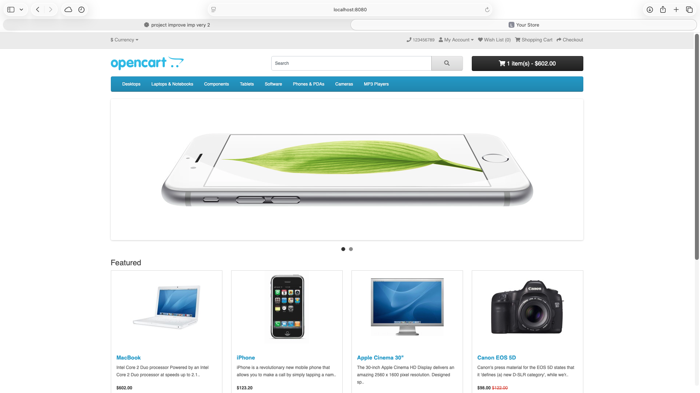
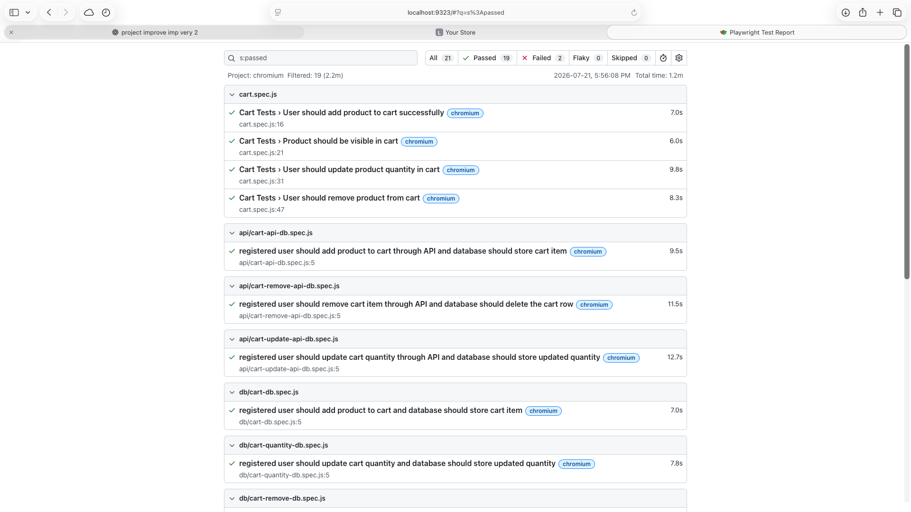
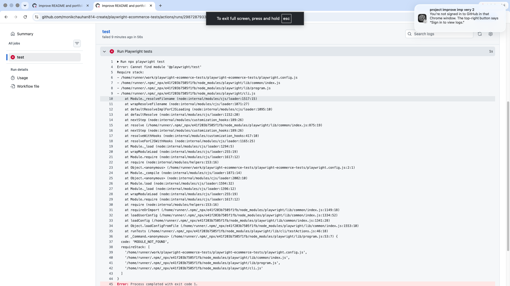

# 🚀 OpenCart Test Automation Framework
## Repository

GitHub: https://github.com/monikchauhan814-create/playwright-ecommerce-tests

> **End-to-End Test Automation Framework demonstrating UI, API and Database validation using Playwright, JavaScript, MySQL, Docker and GitHub Actions.**


---

## 📑 Table of Contents

- [Project Overview](#-project-overview)
- [Project Goal](#-project-goal)
- [Framework Architecture](#-framework-architecture)
- [Automation Flow](#-automation-flow)
- [Technology Stack](#-technology-stack)
- [Project Structure](#-project-structure)
- [Framework Design](#-framework-design)
- [Test Coverage](#-test-coverage)
- [Manual Test Scenarios](#-manual-test-scenarios)
- [Technical Challenges Solved](#-technical-challenges-solved)
- [Project Evolution](#-project-evolution)
- [Reusable Components](#-reusable-components)
- [Design Decisions](#-design-decisions)
- [Framework Highlights](#-framework-highlights)
- [Installation](#-installation)
- [Running the Test Suites](#-running-the-test-suites)
- [HTML Reports](#-html-reports)
- [Continuous Integration](#-continuous-integration)
- [Skills Demonstrated](#-skills-demonstrated)
- [Future Improvements](#-future-improvements)
- [What I Learned](#-what-i-learned)
- [Why This Project Matters](#-why-this-project-matters)
- [About the Author](#-about-the-author)

---

## 📖 Project Overview

This repository demonstrates a comprehensive **OpenCart Test Automation Framework** that validates application behaviour across multiple testing layers.

The project originally began as a **Playwright UI automation framework** focused on validating core e-commerce user journeys such as registration, authentication, product browsing, cart management and checkout.

To further strengthen automation skills and simulate a real-world QA framework, the project was later expanded into a complete automation solution by introducing:

- HTTP API testing
- MySQL database validation using SQL
- Docker-based local OpenCart environment
- Reusable automation helpers
- Modular UI, API and Database test suites
- Improved synchronization using `expect.poll()`

The framework now validates that user actions are correctly reflected across the **User Interface**, **REST API**, and **MySQL Database**, providing end-to-end verification of critical business workflows.

---

## 🎯 Project Goal

The objective of this project is to demonstrate practical QA Automation skills by validating business functionality through multiple layers instead of relying only on browser automation.

Rather than simply verifying what appears on the screen, this framework confirms that application data is correctly processed through the backend and persisted in the database, providing stronger confidence in application quality.

---

# 🏗️ Framework Architecture

This repository contains two complementary OpenCart automation environments.

The original Playwright project focuses on end-to-end UI automation, while the second environment extends the framework with REST API testing and MySQL database validation using a locally hosted Docker setup.

<p align="center">
  
</p>

---

## 🔄 Automation Flow

### Original OpenCart Environment

The original automation suite validates complete end-to-end user journeys through the browser, including:

- User Registration
- User Authentication
- Product Browsing
- Shopping Cart
- Checkout Validation

---

### Local Docker Environment

The Docker-based OpenCart environment extends automation beyond the browser by validating multiple application layers.

A typical workflow is:

```text
Playwright Test
      │
      ▼
UI Action / API Request
      │
      ▼
OpenCart Application
      │
      ▼
MySQL Database
      │
      ▼
SQL Verification
```

This approach verifies not only that the application behaves correctly in the browser, but also that backend data is accurately created, updated and removed from the database.

# 🧰 Technology Stack

| Category | Technology |
|----------|------------|
| Programming Language | JavaScript (ES6) |
| Automation Framework | Playwright |
| API Testing | Playwright API Testing (APIRequestContext) |
| Database | MySQL |
| Database Validation | SQL |
| Application Under Test | OpenCart |
| Local Environment | Docker |
| Runtime | Node.js |
| Version Control | Git |
| Repository Hosting | GitHub |
| Continuous Integration | GitHub Actions |

---

# 📂 Project Structure

```text
playwright-ecommerce-tests/
│
├── .github/
│   └── workflows/
│       └── playwright.yml
│
├── helpers/
│   ├── cart.js
│   └── navigation.js
│
├── tests/
│   ├── api/
│   │   ├── cart-api-db.spec.js
│   │   ├── cart-remove-api-db.spec.js
│   │   ├── cart-update-api-db.spec.js
│   │   └── register-api-db.spec.js
│   │
│   ├── db/
│   │   ├── cart-db.spec.js
│   │   ├── cart-quantity-db.spec.js
│   │   ├── cart-remove-db.spec.js
│   │   ├── customer-registration-db.spec.js
│   │   ├── db-connection.spec.js
│   │   ├── duplicate-registration-db.spec.js
│   │   └── login-db.spec.js
│   │
│   ├── helpers/
│   │   └── registerUser.js
│   │
│   ├── cart.spec.js
│   ├── login.spec.js
│   └── registration.spec.js
│
├── utils/
│   └── db.js
│
├── .env
├── .gitignore
├── manual-test-scenarios.md
├── package-lock.json
├── package.json
├── playwright.config.js
└── README.md
```

### Directory Overview

| Path | Purpose |
|---|---|
| `tests/` | Original Playwright UI automation tests. |
| `tests/api/` | API workflows with MySQL database validation. |
| `tests/db/` | UI workflows and database connection checks validated against MySQL. |
| `tests/helpers/` | Shared registration helper used by API and database suites. |
| `helpers/` | Reusable helpers for the original UI automation suite. |
| `utils/db.js` | Shared MySQL query utility. |
| `manual-test-scenarios.md` | Manual scenarios that supported test planning and automation design. |
| `before-click.png` | Development screenshot to be reviewed for documentation value. |
| `.github/workflows/` | GitHub Actions workflow configuration. |

---

# 🧩 Automation Framework Design

The framework is organized into independent test suites, with each suite focusing on a specific validation layer of the application.

This modular structure improves readability, simplifies maintenance, and allows targeted execution during development and debugging.

---

### UI Test Suite

Automates end-to-end user workflows through the browser using Playwright.

Key scenarios include:

- User Registration
- User Login
- Product Interaction
- Shopping Cart Management
- Checkout Validation

---

### Database Validation Suite

Validates that user actions performed through the UI correctly update the MySQL database.

Key scenarios include:

- Customer Registration
- Duplicate Email Validation
- Customer Login
- Shopping Cart Creation
- Cart Quantity Update
- Cart Item Removal

---

### API Validation Suite

Validates OpenCart HTTP API endpoints while confirming backend database updates.

Key scenarios include:

- Customer Registration
- Add Product to Cart
- Update Cart Quantity
- Remove Cart Item

Each API test verifies:

- HTTP response
- Database state
- Business operation integrity

# ✅ Test Coverage

The framework validates OpenCart across three independent testing layers: **UI Automation**, **Database Validation**, and **API + Database Validation**.

| Test Suite | Scenario | Validation Layer |
|------------|----------|------------------|
| **UI** | User Registration | Browser |
| **UI** | User Login | Browser |
| **UI** | Invalid Login | Browser |
| **UI** | Duplicate Registration | Browser |
| **UI** | Password Validation | Browser |
| **UI** | Add Product to Cart | Browser |
| **UI** | Update Cart Quantity | Browser |
| **UI** | Remove Product from Cart | Browser |
| **UI** | Checkout Validation | Browser |
| **Database** | Customer Registration | MySQL |
| **Database** | Duplicate Email Validation | MySQL |
| **Database** | Customer Login | MySQL |
| **Database** | Add Cart Item | MySQL |
| **Database** | Update Cart Quantity | MySQL |
| **Database** | Remove Cart Item | MySQL |
| **API** | Customer Registration | HTTP API + MySQL |
| **API** | Add Cart Item | HTTP API + MySQL |
| **API** | Update Cart Quantity | HTTP API + MySQL |
| **API** | Remove Cart Item | HTTP API + MySQL |

### Coverage Summary

- **UI Automation** validates customer-facing workflows through the browser.
- **Database Validation** confirms that UI actions correctly create, update, and remove records in MySQL.
- **API Validation** verifies HTTP API endpoints while confirming backend database integrity using SQL queries.

---

## 📋 Manual Test Scenarios

This repository also includes a collection of manual test scenarios created for the original AwesomeQA OpenCart application.

These scenarios demonstrate the test design process used before and alongside automation, covering positive and negative test cases for registration, login, shopping cart, and checkout workflows.

See [`manual-test-scenarios.md`](manual-test-scenarios.md) for the complete list.

# 🔍 Technical Challenges Solved

Developing this framework involved solving several practical automation challenges to improve reliability, maintainability, and scalability across the UI, API, and database test suites.

---

## Initial UI Automation Framework

### Parallel Execution Issues

Tests initially interfered with one another because they shared application state, particularly shopping cart data.

**Solution**

- Improved test isolation by ensuring each test managed its own application state.
- Controlled execution where necessary to eliminate shared-state conflicts.

---

### Shared Cart State

Multiple tests modified the same shopping cart, leading to inconsistent results and flaky execution.

**Solution**

- Redesigned test flows so each scenario started with a predictable application state.
- Ensured shopping cart operations remained independent across test cases.

---

### Locator Ambiguity

Some UI elements produced multiple locator matches, making browser automation unreliable.

**Solution**

- Replaced ambiguous selectors with Playwright's role-based locators such as `getByRole()`.
- Used more specific locator strategies to improve test stability and readability.

---

## Framework Expansion (UI, API & Database Validation)

### Session & Cookie Management

Automated registration required preserving the `OCSESSID` session cookie. Without maintaining the session, dynamically generated registration tokens became invalid, causing registration requests to fail.

**Solution**

- Preserved the session cookie before registration.
- Restored the required cookies before continuing the registration workflow.
- Built a reliable registration process for UI, API, and database validation.

---

### Database Synchronization

Database updates occur asynchronously, making fixed delays unreliable.

**Solution**

- Replaced `waitForTimeout()` with Playwright's `expect.poll()`.
- Waited for actual database changes instead of arbitrary time delays.
- Improved test reliability while reducing flaky execution.

---

### Reusable Test Design

Registration logic was required across multiple UI, API, and database test suites.

**Solution**

- Created a reusable `registerUser()` helper.
- Eliminated duplicated setup code.
- Improved maintainability and readability throughout the framework.

---

### API & Database Validation

API automation validates more than successful HTTP responses by confirming that backend database records are correctly updated.

**Solution**

Each API test verifies:

- HTTP response
- Database records
- End-to-end business operation integrity

This provides stronger validation than API-only or UI-only testing.

---

### Multi-Layer Validation

The framework validates complete business workflows across multiple application layers.

```text
                 Browser UI
                      │
                      ▼
           OpenCart Application
               │            │
               ▼            ▼
          HTTP API     MySQL Database
                            │
                            ▼
                    SQL Verification
```

This multi-layer validation ensures that user actions are successfully processed through the application and correctly persisted in the database, providing greater confidence than UI-only automation.

---

# 📈 Project Evolution

This project evolved in stages as new testing requirements were introduced. It began as a browser automation project and gradually expanded into a multi-layer automation framework incorporating UI, API, and database validation.

---

## Phase 1 – UI Automation

The project began as a Playwright-based UI automation framework for an OpenCart e-commerce application.

The initial focus was automating core customer workflows, including:

- User Registration
- User Login
- Product Browsing
- Shopping Cart Management
- Checkout Validation

This phase established the foundation of the automation framework and reusable browser interactions.

---

## Phase 2 – Database Validation

To increase confidence beyond browser assertions, MySQL database validation was introduced.

Critical UI workflows were verified against the database to ensure user actions correctly created, updated, and removed application data.

Database validation was implemented for:

- Customer Registration
- Duplicate Email Validation
- Customer Login
- Shopping Cart Creation
- Cart Quantity Update
- Cart Item Removal

---

## Phase 3 – API Validation

The framework was further expanded with HTTP API automation using Playwright's API testing capabilities.

Each API test validates both the HTTP response and the corresponding database updates, providing confidence that backend business operations execute correctly.

Implemented API scenarios include:

- Customer Registration
- Add Product to Cart
- Update Cart Quantity
- Remove Cart Item

---

## Phase 4 – Framework Refactoring

As the framework grew, common functionality was extracted into reusable components to improve maintainability and reduce duplicated code.

Key improvements included:

- Reusable `registerUser()` helper
- Shared `queryDB()` database utility
- Modular UI, API, and Database test suites
- Improved synchronization using `expect.poll()`
- Cleaner and more maintainable project structure

---

### Framework Growth

```text
Phase 1
UI Automation
      │
      ▼
Phase 2
Database Validation
      │
      ▼
Phase 3
HTTP API + Database Validation
      │
      ▼
Phase 4
Framework Refactoring
```

# 🧩 Reusable Components

To improve maintainability and reduce duplicated code, the framework includes reusable helpers and utilities that are shared across multiple test suites.

## `registerUser()`

Responsible for:

- Creating a unique test user
- Completing the registration workflow
- Returning customer information for reuse across tests

Used by:

- Database Test Suite
- API Test Suite
- UI test scenarios requiring an authenticated user

---

## `queryDB()`

Provides a reusable interface for executing SQL queries against the MySQL database.

Used for validating:

- Customer records
- Shopping cart records
- Product information
- Database updates after UI workflows
- Database updates after API requests

---

These reusable components keep test cases focused on business validation rather than setup logic, improving readability, consistency, and long-term maintainability throughout the framework.

---

# 🏛️ Design Decisions

Several design decisions were made throughout the project to improve reliability, maintainability, and long-term scalability.

---

## Why create a reusable `registerUser()` helper?

The registration workflow is required by multiple UI, API, and database test suites.

Extracting this workflow into a reusable helper eliminated duplicated setup code while ensuring every test begins from a consistent application state.

---

## Why verify the database?

Browser assertions alone cannot confirm whether application data has been correctly persisted.

Database verification provides additional confidence that business operations successfully create, update, and remove records in MySQL.

---

## Why use `expect.poll()`?

Database updates occur asynchronously, making fixed delays unreliable.

Using Playwright's `expect.poll()` allows tests to wait for actual database state changes instead of relying on arbitrary time delays, improving reliability and reducing flaky execution.

---

## Why separate UI, API, and Database test suites?

Organizing tests by validation layer makes the framework easier to maintain, extend, and execute independently during development and debugging.

---

# ⭐ Framework Highlights

This project extends traditional UI automation by validating application behaviour across multiple layers of the system.

## Highlights

- End-to-end UI automation using Playwright
- HTTP API validation using Playwright API Testing
- MySQL database verification using SQL queries
- Docker-based local OpenCart environment
- Reusable helper functions for common workflows
- Modular UI, API, and Database test suites
- Multi-layer validation across the UI, API, and database
- GitHub Actions CI pipeline
- Playwright HTML reporting
- Maintainable and scalable automation framework

## Screenshots

### OpenCart Homepage



---

### Playwright HTML Report



---

### GitHub Actions CI



---

# ⚙️ Installation

## Prerequisites

Before running the project, make sure the following tools are installed:

- Node.js
- npm
- Git
- Docker Desktop
- Playwright browsers

The original UI test suite can run without Docker.

The API and database validation suites require the local OpenCart and MySQL containers to be running.

---

## Clone the Repository

```bash
git clone https://github.com/monikchauhan814-create/playwright-ecommerce-tests.git
cd playwright-ecommerce-tests
```

---

## Install Project Dependencies

```bash
npm install
```

---

## Install Playwright Browsers

```bash
npx playwright install
```

---

## Configure Environment Variables

Create a `.env` file in the project root and add the database connection values required by `utils/db.js`.

Example:

```env
DB_HOST=localhost
DB_PORT=3306
DB_USER=root
DB_PASSWORD=root
DB_NAME=opencart
```

Do not commit the `.env` file to GitHub. Make sure `.env` is included in `.gitignore`.

---

## Start the Local OpenCart Environment

Before running the API or database suites:

1. Open Docker Desktop.
2. Start the OpenCart container.
3. Start the MySQL container.
4. Confirm the local OpenCart website is available at:

```text
http://localhost:8080
```

5. Confirm MySQL is available on the port configured in `.env`.

The original UI automation suite uses the AwesomeQA OpenCart website and does not require the local Docker environment.

# ▶️ Running the Test Suites

The framework supports running individual test files, entire test suites, or the complete automation framework.

---

## Run an Individual Test

During development, individual test files can be executed to validate a specific workflow.

Example:

```bash
npx playwright test tests/db/duplicate-registration-db.spec.js --headed
```

The `--headed` option launches a visible browser window, making it useful for debugging and observing test execution.

---

## Run an Entire Test Suite

### UI Automation

```bash
npx playwright test tests
```

### Database Validation

```bash
npx playwright test tests/db
```

### API Validation

```bash
npx playwright test tests/api
```

---

## Run the Complete Framework

Execute every test in the repository:

```bash
npx playwright test
```

---

## Generate the HTML Report

After the test run completes, open the Playwright HTML report:

```bash
npx playwright show-report
```

The report includes:

- Test execution summary
- Passed and failed tests
- Execution duration
- Error details
- Stack traces
- Screenshots and traces (when available)

---

# 📊 HTML Reports

Playwright automatically generates an interactive HTML report after test execution, making it easier to review results and investigate failures.

To open the report:

```bash
npx playwright show-report
```

The HTML report provides:

- Overall test execution summary
- Passed, failed, and skipped tests
- Test execution duration
- Detailed error messages
- Stack traces for failed tests
- Screenshots and traces (when available)
- Step-by-step execution timeline

The report helps simplify debugging by providing a clear visual overview of each test run and allows failures to be investigated without rerunning the entire test suite.

---

# 🚀 Continuous Integration (CI)

This project includes a GitHub Actions workflow that automatically executes the Playwright test suite whenever code is pushed to or a pull request is opened against the repository.

The workflow helps identify regressions early and ensures the automation framework remains stable as changes are introduced.

## Workflow Capabilities

The CI pipeline automatically:

- Checks out the repository
- Sets up the Node.js environment
- Installs project dependencies using `npm ci`
- Installs Playwright browsers and required system dependencies
- Executes the Playwright test suite
- Generates the Playwright HTML report
- Uploads the HTML report as a GitHub Actions artifact (retained for 30 days)

The workflow configuration is located at:

```text
.github/workflows/playwright.yml
```

Using GitHub Actions enables automated validation of the framework without requiring manual test execution.

---

# 💡 Skills Demonstrated

This project showcases practical experience in the following areas:

| Skill | Demonstrated Through |
|--------|----------------------|
| UI Automation | End-to-end browser workflows |
| HTTP API Testing | OpenCart HTTP API endpoints |
| Database Testing | SQL validation against MySQL |
| Test Automation Framework Design | Modular project structure and reusable helpers |
| Synchronization | Replacing fixed waits with `expect.poll()` |
| Debugging | Session handling, cookies, AJAX registration |
| Refactoring | Shared `registerUser()` helper and cleaner test design |
| CI/CD | GitHub Actions workflow |
| Version Control | Git and GitHub |

---

# 📈 Future Improvements

Potential enhancements for the framework include:

- Expanding API test coverage
- Increasing database validation scenarios
- Cross-browser execution
- Data-driven test execution
- Docker Compose setup for easier environment initialization

These improvements would further increase the framework's scalability and automation coverage.

 


# 📚 What I Learned

Developing this framework provided practical experience beyond traditional UI automation and strengthened my understanding of building reliable, maintainable test automation frameworks.

Key learning outcomes include:

- Designing reusable automation components to reduce duplicated code.
- Validating backend data using SQL queries.
- Combining browser automation, HTTP API testing, and database validation within a single framework.
- Improving automation reliability through better synchronization using Playwright.
- Understanding session and cookie management in OpenCart.
- Structuring automation projects for long-term maintainability and scalability.
- Refactoring common workflows into reusable helper functions.
- Validating complete business workflows across the UI, API, and database.

---

# 🎯 Why This Project Matters

Traditional UI automation confirms that application functionality works from a user's perspective.

This framework extends that validation by confirming that business operations are correctly processed throughout the application stack.

Instead of validating only browser behaviour, the framework verifies:

- The user interface behaves as expected.
- HTTP API requests complete successfully.
- Database records are correctly created, updated, and removed.

By validating the same business workflows across multiple application layers, the framework provides greater confidence in application quality while demonstrating practical QA automation techniques used in modern software testing.

---

# 👨‍💻 About the Author

**Monik Chauhan**

Passionate about building reliable and maintainable test automation frameworks using UI automation, HTTP API testing, and database validation.

This project reflects continuous learning and hands-on experience in:

- Playwright Automation
- SQL Database Validation
- HTTP API Testing
- Automation Framework Design
- Software Quality Assurance

Thank you for taking the time to explore this project.

Feedback and suggestions are always welcome.

---