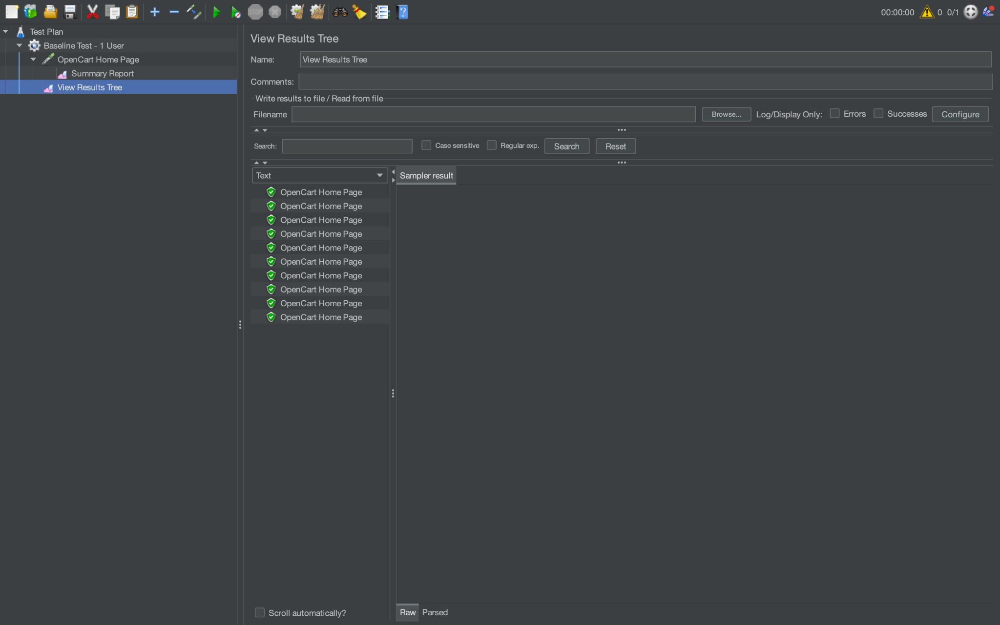
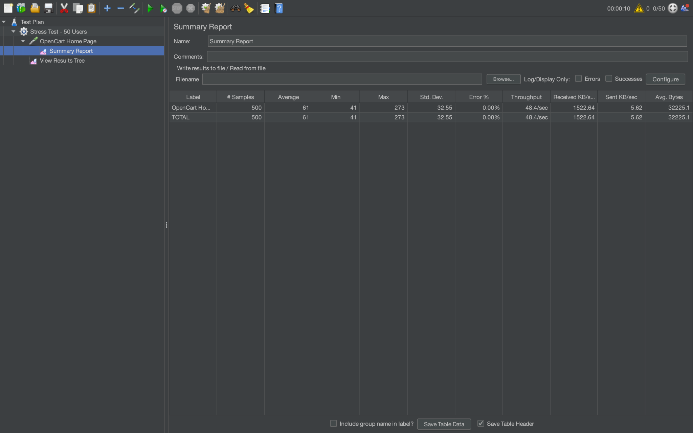
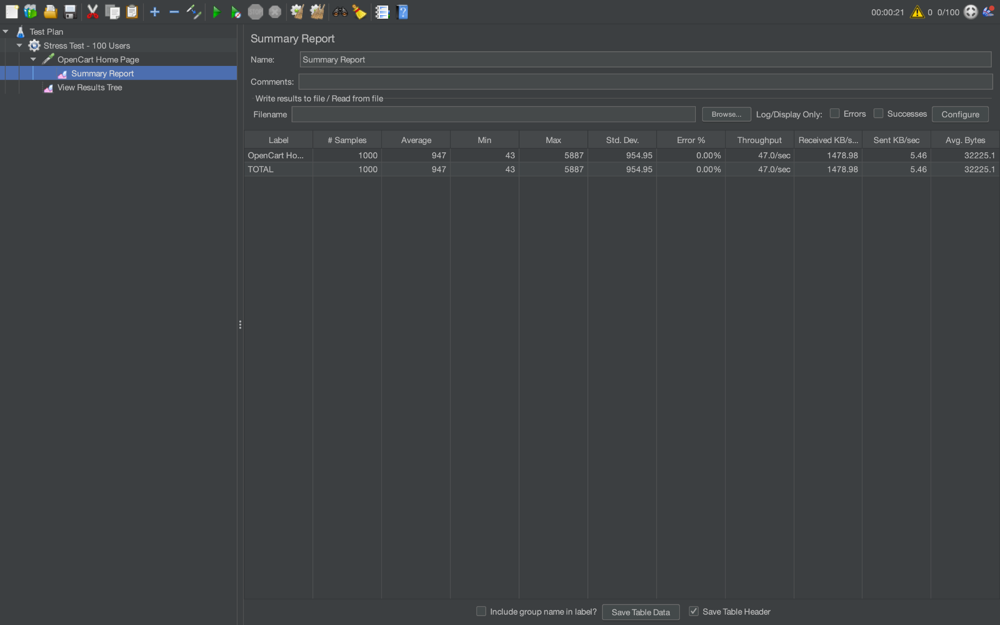
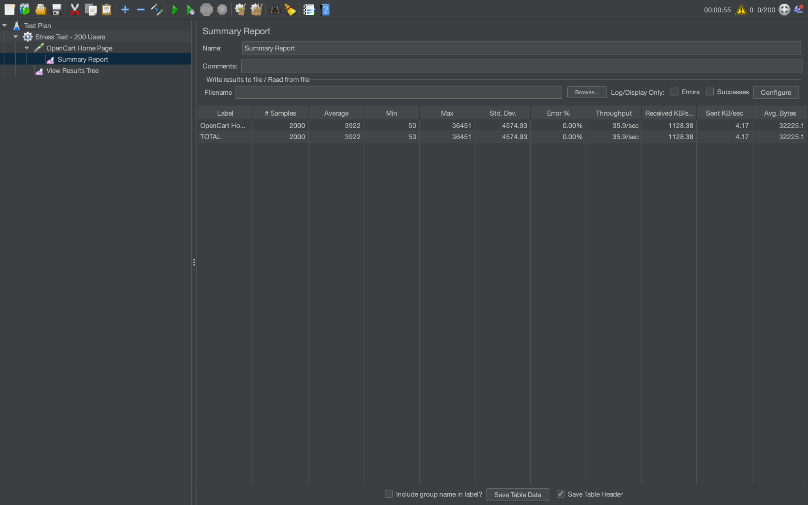

# ⚡ OpenCart JMeter Performance Testing

Performance testing of the local Dockerized OpenCart application using Apache JMeter to observe response time, throughput, stability, and application behavior as virtual-user load increased.

## Test Environment

- **Application:** OpenCart
- **Environment:** Local Docker
- **Tool:** Apache JMeter 5.6.3
- **Endpoint:** HTTP GET `/`
- **Host:** `localhost:8080`

## Test Results

| Virtual Users | Requests | Avg Response | Min | Max | Error % | Throughput |
|---:|---:|---:|---:|---:|---:|---:|
| 1 | 10 | 63 ms | 43 ms | 241 ms | 0% | 15.7/sec |
| 10 | 100 | 52 ms | 40 ms | 254 ms | 0% | 10.5/sec |
| 50 | 500 | 61 ms | 41 ms | 273 ms | 0% | 48.4/sec |
| 100 | 1000 | 947 ms | 43 ms | 5887 ms | 0% | 47.0/sec |
| 200 | 2000 | 3922 ms | 50 ms | 36451 ms | 0% | 35.9/sec |
| 300 | 3000 | 4898 ms | 69 ms | 49495 ms | 0% | 41.4/sec |

## Findings

- **0% HTTP errors** were recorded across all documented test runs.
- Response times remained low through the **50-user test**, averaging **61 ms**.
- At **100 virtual users**, average response time increased substantially to **947 ms**.
- At **200 virtual users**, average response time increased to **3.9 seconds**, while throughput dropped to **35.9 requests/sec**.
- At **300 virtual users**, average response time reached **4.9 seconds**, with a maximum response time of approximately **49.5 seconds**.
- Throughput did not increase proportionally with additional virtual-user load.
- The results demonstrate increasing latency under heavier load even though the application continued returning successful HTTP responses.

## Test Evidence

### Baseline — 1 Virtual User

The baseline test established application behavior under minimal load: **10 requests**, **63 ms average response time**, and **0% errors**.

### Baseline Request Validation

JMeter's **View Results Tree** was used to verify successful OpenCart HTTP requests during baseline execution.

### Stress Test — 50 Virtual Users

At 50 virtual users, JMeter executed **500 requests** with an average response time of **61 ms**, throughput of **48.4 requests/sec**, and **0% errors**.

### Stress Test — 100 Virtual Users

At 100 virtual users, JMeter executed **1,000 requests**. Average response time increased to **947 ms**, indicating significant latency growth compared with the 50-user test.

### Stress Test — 200 Virtual Users

At 200 virtual users, JMeter executed **2,000 requests**. Average response time increased to **3,922 ms**, with a maximum response time of **36,451 ms**.

### Stress Test — 300 Virtual Users

At 300 virtual users, JMeter executed **3,000 requests** with an average response time of **4,898 ms** and maximum response time of **49,495 ms**.

## Performance Testing Skills Demonstrated

Apache JMeter • Performance Testing • Load Testing • Stress Testing • Baseline Testing • Response-Time Analysis • Throughput Analysis • HTTP Request Testing • Performance Bottleneck Identification • Test Result Analysis